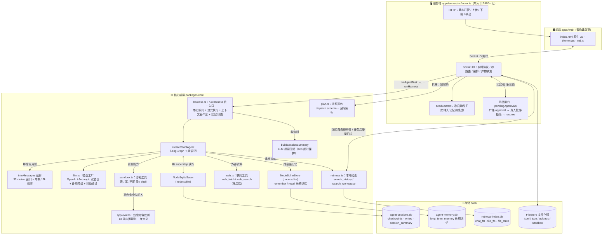
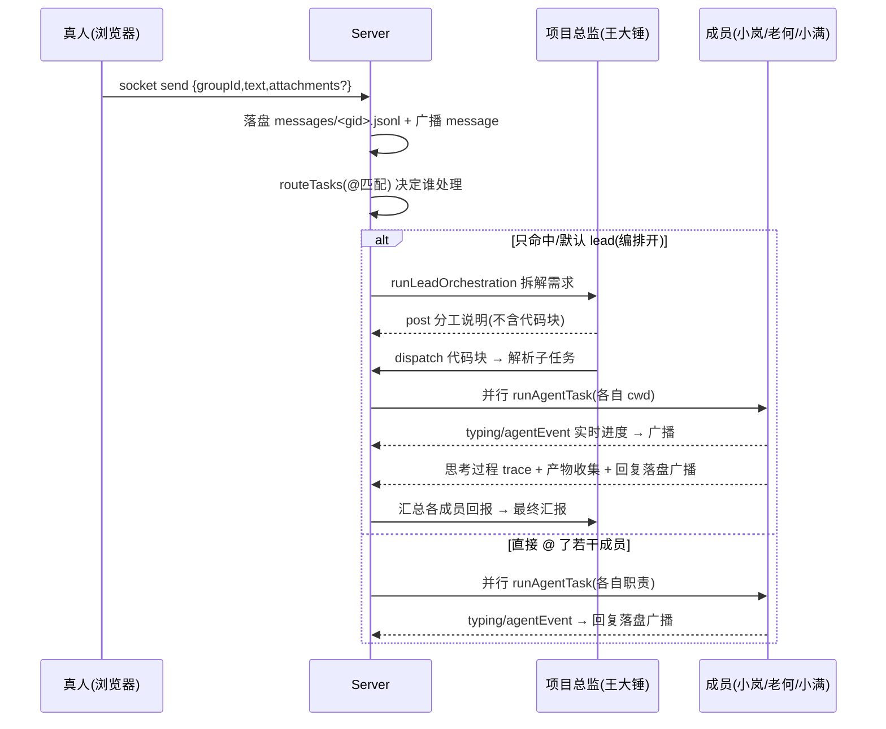

# agent-hive · 微信式多工作区 AI 研发团队工作台

把一整个 AI 研发团队拉进一个工作区：真人把需求丢进工作区里，项目总监（王大锤）拆解任务并 `@` 分派给前端（小岚）、后端（老何）、测试（小满），每位成员通过 **langchain 编排 + 沙箱工具** 获得真实的文件读写 / 命令执行能力，动手干完活后在工作区里汇报，全程「正在做什么」与「思考过程」实时可见。

技术底座：**Node + TypeScript 全栈**，单页面前端（原生 JS，零构建）+ Socket.IO 实时通道 + 文件存储引擎，agent 由 **LangChain / LangGraph 编排**，支持 **OpenAI 兼容（含 DeepSeek）与 Anthropic（Claude）** 双协议直连，进程内调用无冷启动。

---

## 特性速览

- **微信式消息界面**：多工作区、成员可配、未读红点、消息内 markdown 渲染（含 XSS 防护）
- **真实干活**：agent 不是聊天机器人——它拿到的是工作区目录，能读写文件、跑命令、访问网络
- **协作编排**：项目总监拆解需求 → 输出 `dispatch` 分派计划 → 成员并行执行 → 汇总验收
- **思考过程可见**：每个 agent 的推理步骤 / 工具调用 / 结果随回复一起展示（可折叠 trace）
- **文件与图片**：真人可上传附件（图片消息直接预览），agent 产物自动收集进「工作区文件区」
- **历史分页**：进入工作区只拉最近一页，更早消息按需翻页；工作区内搜索自动覆盖全历史
- **定时任务**：每 N 分钟 / 每日定点，以「⏰ 定时任务」身份自动发消息触发干活
- **Git 集成**：工作区可直接克隆 http(s) 仓库作为共享工作目录；聊天输入框上方的 **Git 条**实时显示当前绑定目录、分支/远端与未提交改动数。**提交并推送由 AI 在会话里完成**——在群里 @ 写码成员说「把本次改动提交并推送」，它会用 `run_shell` 执行 git add/commit（提交说明由 AI 按实际改动撰写）并 push；认证走**仓库级凭据**（你首次在 🔑 凭据里输入保存、可修改，克隆 URL 内嵌账号也会自动留存，凭据文件在 `data/git/.creds/`、不入 `.git/config`）；git 缺失时服务启动会自动后台安装（Windows→winget / 容器 alpine→apk / debian→apt / dnf），无需手工装
- **会话记忆持久化**：每个成员的上下文经 LangGraph checkpointer 落盘 SQLite（`data/agent-sessions.db`），server 重启不丢；早期内容自动 LLM 压缩成摘要防「忘初心」；可单独「重置会话」；支持给工作区绑定共享目录（如 git 仓库）直接改真实项目
- **本地检索**：群聊消息 + 工作区文件建全文索引（`data/retrieval-index.db`，FTS5 trigram 中文友好），agent 通过 `search_history` / `search_workspace` 工具检索**上下文窗口外**的历史与文件——不占 LLM 窗口也能"记得"全局
- **联网能力**：「设置 → 🌐 联网」可开启 `web_fetch`（抓网页转纯文本，智能解码 UTF-8/GBK）与 `web_search`（默认 Bing，免 key 国内可直连；另备 DuckDuckGo / SearXNG / Bocha / Tavily），让 agent 能查外部资料而不是凭记忆编
- **🛡 危险命令人工审批**：`run_shell` 命中内置 13 条高危规则（递归删除 / 强制推送 / 提权 / 读凭据 / 管道执行远端脚本 / 发布 …）时**整张图挂起**，工作区弹出审批卡等待真人「批准 / 拒绝」，批准后才真正执行、拒绝则告知模型改道——把「提示词里劝它别乱来」升级为图级硬闸门；规则可自定义、等待超时可配
- **长期记忆**：本地 SQLite BaseStore（`data/agent-memory.db`），成员用 `remember` / `recall` 工具跨会话沉淀「这个项目的约定 / 踩过的坑」，不受 thread 与上下文窗口限制
- **模型降级 + 网关抖动重试**：所有模型调用恒套一层 `ResilientChatModel`——同一节点先按「网关抖动」**原样重发**（默认 8 次尝试、几何退避 0.4→4s，环境变量可调），用尽才降级到备用模型；这套包装对调用方透明（`bindTools` / 流式 / 结构化输出全透传），且**只重发"还没吐出任何增量"的请求**（已吐过再重发会重复输出）
- **结构化拆解**：lead 的 `dispatch` 计划写在**正文的代码块**里（本项目网关不认 `tool_choice`，见下文「拆解」），计划写坏了会**明确告诉真人**而不是静默降级成「没人干活」；harness 仍保留 `responseFormat` 结构化能力，解析失败时**先退回本轮已产出的正文**、连正文都没有才摘掉 schema 重跑
- **iOS 设计语言**：iPhone 风格界面，明暗双主题跟随系统

---

## 环境要求与快速启动

| 项 | 说明 |
|---|---|
| Node.js | **≥ 22.5**（会话记忆用内置 `node:sqlite`，零原生模块编译；开发机验证于 22.x） |
| 包管理器 | npm |
| LLM 通道 | 已内置：`npm install` 自动安装 `@langchain/*` 编排依赖，agent 进程内直连模型 API，无子进程冷启动 |
| 认证 | 自包含直连：OpenAI 兼容协议默认 `api.deepseek.com`、Anthropic 协议默认 `api.anthropic.com`（均可自定义地址）。Token 在「设置 → LLM 接入」填，或设 `DEEPSEEK_API_KEY` / `ANTHROPIC_API_KEY` 环境变量 |

```bash
# 1. 安装依赖（langchain 编排依赖随安装内置）
npm install

# 2. 启动开发服务器（默认端口 18741）
npm run dev
#    或热重载： npm run dev:watch
#    生产模式： npm run build && npm start
```

> 启动脚本自带 `--disable-warning=ExperimentalWarning --import tsx/esm`：同进程跑 TS（避免 tsx CLI 子进程的警告残留），并屏蔽 `node:sqlite` 的实验性提示，**启动零警告**。

启动成功后打开 **http://127.0.0.1:18741/** 即进入工作台。日志会打印实际端口与数据目录：

```
agent-hive server: http://127.0.0.1:18741
  数据目录: <cwd>/data
  UI: <cwd>/apps/web
```

> 协议与地址：`LLM_PROTOCOL=openai`（默认，OpenAI 兼容，直连 `api.deepseek.com`）或 `anthropic`（Claude / DeepSeek anthropic 端点）。`LLM_BASE_URL` 可覆盖默认地址。
> 会话连续：每 (agent, 工作目录) 的上下文经 checkpointer 持久化到 `data/agent-sessions.db`，可单独「重置会话」。无 dsh runtime、无子进程冷启动、无孤儿锁问题。

---

## 内置团队

角色定义在 `packages/core/src/agents.ts`，`id` / `role` 锁定，`persona` / `rules` / 颜色昵称可在「设置」里改。

| id | 昵称 | 角色 | 职责 | 默认模型 | 工具白名单 |
|---|---|---|---|---|---|
| `ai-lead` | 🧑‍💼 王大锤 | lead | 项目总监：对接真人需求、拆解分派、汇总验收 | 继承全局 | **只读**（read/list/search/recall，无写文件与命令——防总监抢活） |
| `ai-fe` | 🎨 小岚 | fe | 前端工程师：React/TS/CSS/UI | 继承全局 | 全量 |
| `ai-be` | ⚙️ 老何 | be | 后端工程师：服务端/API/数据库/架构 | 继承全局 | 全量 |
| `ai-qa` | 🧪 小满 | qa | 测试工程师：用例设计、执行验证、Bug 复现 | 继承全局 | 全量（写测试+跑验证是本职） |

**工具白名单**（`AgentDef.tools`，借鉴 Claude subagent 哲学）：角色只拿到职责内的工具。注意这是模型层聚焦引导（防越权代做/抢活），**不是安全边界**——真正的约束是沙箱路径限制。systemPrompt 中的工具列表动态生成，与白名单一致。

**模型路由**（`AgentDef.llm`，对应 Claude Agent Teams 的 coordinationModel/workerModel 分离）：推荐配置——全局默认轻模型（省 token），lead 单独覆盖强模型（拆解分派汇总质量）。改 `data/settings.json` 对应成员加 `"llm":{"model":"deepseek-v4-pro"}` 即可，零代码。

另有 `human` 固定"真人席位"：登录后的**当前真人**由此发言（登录后才可发消息，见下）。除内置成员外，可在设置中创建自定义成员（`role` 支持 fe/be/qa/ops/design/lead）。

---

## 核心流程

### 架构总览



### 模块职责表

| 层 | 文件 | 行数 | 职责 |
|---|---|---|---|
| 前端 | `apps/web/index.html` | ~2700 | 结构 + 全部逻辑（原生 JS IIFE）：会话列表 / 消息流 / trace 折叠 / 搜索 / 文件区 / 设置；滚动跟随 `scrollBottomIfNear`（距底 <80px 才跟随，不强制拉底）；流式打字机（delta 事件驱动）+ 审批卡（批准/拒绝） |
| 前端 | `apps/web/theme.css` | — | iOS 设计语言主题（明暗双主题跟随系统） |
| 前端 | `apps/web/md.js` | — | 消息 markdown 渲染 + XSS 转义 |
| 服务端 | `apps/server/src/index.ts` | ~2480 | 单入口：HTTP 静态托管 / 上传下载 / 导出 + Socket.IO 实时协议 + `@` 路由 + lead 编排 + **危险命令审批闸门** + 产物 diff 收集 + seedContext 种子注入 + 检索索引维护 + Git 条接口（gitRepoInfo/saveGitCreds/cloneGroupRepo） |
| 服务端 | `apps/server/src/staffDb.ts` | — | 员工通讯录库（mysql2 直查 `uc_staff`） |
| 服务端 | `apps/server/src/gitEnv.ts` | ~300 | **git 环境自举 + 仓库级推送凭据**：启动异步自检缺失时按平台后台安装（winget/apk/apt/dnf，非 root 走 sudo -n）；登录人推送凭据落盘 `data/git-creds.json`（0600）；`setupRepoAuth` 把真人凭据写入仓库级 credential.helper（`data/git/.creds/<gid>`，不入 .git/config），agent 用 run_shell 直接 push 即可过认证；`repoInfo` 快照 / `commitAndPush` / `embeddedCredOf` |
| 核心 | `packages/core/src/harness.ts` | ~790 | **统一执行入口**：会话串行队列、流式事件（updates + messages 双模式）、上下文五件套、**interrupt 挂起 / Command(resume) 续跑**、responseFormat 结构化输出（解析失败**优先退回已产出正文**、无正文才摘掉 schema 重跑）、运行期上下文 `contextSchema` |
| 核心 | `packages/core/src/sqlite-saver.ts` | ~355 | **NodeSqliteSaver**：基于 Node 22 内置 `node:sqlite` 的零依赖 `BaseCheckpointSaver`（schema 与官方 SqliteSaver 完全一致，可互为备份），外加 `pruneThread` 修剪 / `getSummary`·`setSummary` 摘要存取 / `resetThread` 重置 |
| 核心 | `packages/core/src/sqlite-store.ts` | ~295 | **NodeSqliteStore**：`node:sqlite` 零依赖 `BaseStore`（只实现 `batch()`），落盘 `data/agent-memory.db`；对外 `remember` / `searchWorkspaceMemory` / `forget` 等领域方法，供 `remember`·`recall` 工具用 |
| 核心 | `packages/core/src/approval.ts` | ~87 | **危险命令识别**（纯函数、可单测）：13 条内置规则（固定顺序数组，保证首命中稳定）+ 自定义正则编译（非法即忽略）；`detectDangerousCommand` 返回规则 id / 标签 / 上下文片段 |
| 核心 | `packages/core/src/plan.ts` | ~122 | **拆解计划契约**：`DISPATCH_PLAN_SCHEMA`（zod，`.describe()` 当提示词用）+ `normalizeDispatchPlan` + `parseDispatchBlock`（区分"没写计划"与"写了但 JSON 不合法"）+ 结构化回报解析 |
| 核心 | `packages/core/src/retrieval.ts` | ~380 | **本地检索层**：FTS5 trigram 全文索引（`chat_fts` 群聊 + `file_fts` 文件分块），启动异步建索引 + 消息落盘即索引 + agent 产物增量索引；短查询 LIKE 兜底；`snippet()` 窗口 64（trigram 下约 64 字符） |
| 核心 | `packages/core/src/llm.ts` | ~507 | 模型工厂（OpenAI 兼容 / Anthropic 双协议 + `ResilientChatModel`：备用模型降级 + 网关抖动原样重发，8 次尝试 / 几何退避） + 工具定义（`tool()` 包装：沙箱四件套 + 检索两件套 + 联网两件套 + `remember`/`recall`），`run_shell` 内置审批闸门 |
| 核心 | `packages/core/src/web.ts` | ~540 | **联网工具**：`web_fetch` 抓网页转纯文本（去脚本样式 / UTF-8·GBK 智能解码 / 2MB + 8000 字符双限额）+ `web_search` 多后端（bing 默认 / duckduckgo / searxng / bocha / tavily），零依赖实现 |
| 核心 | `packages/core/src/sandbox.ts` | ~115 | 沙箱执行层：路径穿越防护、GBK 智能解码、Windows 引号透传、超时与输出截断（不 import langchain，可单测） |
| 核心 | `packages/core/src/store.ts` | ~115 | FileStore：整文件 JSON 原子替换 + JSONL 追加 + `readLinesTail` 尾部反向扫描 |
| 核心 | `packages/core/src/files.ts` | ~70 | 工作区文件区：目录快照 / diff / 产物登记 |
| 核心 | `packages/core/src/agents.ts` | ~107 | 内置团队定义 + 默认设置（含审批闸门默认开启） |
| 核心 | `packages/core/src/types.ts` | ~130 | AgentDef / ChatMsg / TraceEntry / Settings / LlmConfig（含 fallback）/ ApprovalConfig / WebConfig 类型 |
| 核心 | `packages/core/src/suppress-warning.ts` | ~10 | 拦截 `node:sqlite` ExperimentalWarning（次级兜底） |
| 其他 | `demo.ts` | — | 免 UI 最小端到端演示（direct 调 `runHarness`，加载 `data/settings.json` 的 LLM 配置） |

### 一条消息从发出到落到工作区（完整生命周期）



**处理链路的服务端落点**（`apps/server/src/index.ts`）：

1. **`socket.on("send")`**：校验工作区存在 → 生成 `ChatMsg`（按附件全部为图片判定 `image` 消息，否则 `file`，纯文本为 `text`）→ `appendMsg` 落盘 → 广播 `message` → 交给分发器 `dispatchGroupText`。
2. **`dispatchGroupText`**：附件绝对路径注入任务文本（agent 能直接读到上传文件）→ 按原文 `@` 路由 → 若只命中 lead（且未显式 @ 他人）走编排 `runLeadOrchestration`；否则对命中的每个成员并行 `runAgentTask`。
3. **`runAgentTask(agent)`**：经过 `memberQueues` 同成员串行排队（队列覆盖**整段审批等待**，否则第二条消息会交错写同一 thread）→ 广播 `typing` → 对 agent 的工作区目录做文件快照 `scanDir` → 调 `runHarness`（事件流）→ 结束后 `diff` 出新产物收集进工作区文件区 → 组装回复（含失败信息）→ `postAgentReply` 落盘 + 广播（带 trace）→ 广播 `done`。
   **若中途触发危险命令审批**：`runHarness` 返回 `paused=true` + 中断载荷 → 服务端广播 `approval` 审批卡并**阻塞等待真人决定**（超时视为拒绝）→ 拿到决定后用 `Command({resume})` 续跑同一张图（循环直到不再挂起）→ 无人处理则回复「⏸ 已挂起但无人批准，命令未执行」。
   > 系统提示词明确要求：**高危命令单独调用一次**，不要与其它工具放在同一批——因为 resume 会重放被中断的 tools 节点，同批的其它工具会被重复执行。

### 路由规则：这条消息谁处理

`routeTasks(groupId, text)` 依次判定：

| 命中方式 | 条件 | 结果 |
|---|---|---|
| 显式 `@` | 文本含 `@昵称` / `@全名` / `@角色别名`（如 `@前端`） | 命中的所有成员，**并行**处理 |
| 裸昵称 | 无 `@` 但提到短名（如提到「老何」） | 命中成员处理 |
| 默认接管 | 谁都没命中且设置 **自动接管** 开启 | lead 接管（编排） |
| 打招呼 | 以 你好/hi/hello/谢谢/ok 等开头 | 不触发任何 agent |

> 开关：设置里的 **自动接管**（`autoReply`）控制「无 @ 时 lead 是否自动接需求」；**编排分派**（`orchestrate`）控制 lead 是否拆解分派。两个都关时，只有显式 `@` 才会叫人干活。

### 编排模式：拆解 → 分派 → 依赖分波 → 汇总

1. **拆解**：lead 收到需求先输出对需求的理解与分工计划（展示给工作区），分派计划就走**正文里的 dispatch 代码块**（严格 JSON，最多 4 个子任务，可选 `dependsOn` 声明依赖），由 `parseDispatchBlock` 解析并校验（写了块但 JSON 非法会明确报给真人，不再静默当成「无需分派」）。
   > 为什么不用 `responseFormat` 的结构化输出主路径：本项目实际使用的网关（Anthropic 协议 + thinking 模式，deepseek-v4-flash）**不认 `tool_choice`** —— 同一份拆解提示词下，不带 / `{type:auto}` / `{type:any}` / `{type:tool,name}` 四种写法全部返回 `text + end_turn`，模型一律用正文作答，于是 `generate_structured_response` 节点必然取不到 tool_call，整轮报错（真人 @总监 说句「你好」就吃「执行失败」）。该能力在 harness 层保留（且已加固为「失败退回正文」），但服务器不再使用。
   ````text
   ```dispatch
   {"subtasks":[{"agent":"小岚","task":"..."},{"agent":"老何","task":"..."},{"agent":"小满","task":"...","dependsOn":[2]}],"self":"lead 自己做的那部分"}
   ```
   ````
   > **为什么留兜底**：`parseDispatchBlock` 返回 `{plan, malformed}` 两个信息——「压根没写 dispatch 块」（简单需求直接回答，正常）与「写了但 JSON 不合法」（必须报给真人）是两件事。旧实现失败时静默返回 `null`，退化成一个没人被分派的结果，真人只看到总监讲了计划却不知为何没人开工；现在后者会明确回一条「⚠️ 计划格式不合法、本次没有成员被分派」。
2. **分派**：服务端解析该代码块（不把原始 JSON 发到工作区），把干净版本 `post` 到工作区，然后按依赖**分波执行**（借鉴 Agent Teams 的 blockedBy）：同波子任务并行、有依赖的等上游完成再启动（如测试等接口文档）；循环依赖兜底并波不阻塞。
3. **执行**：每个成员只做自己职责相关部分（多并发时系统会注入提示避免越界代做）；下游任务会收到提示——上游的结构化回报已进群聊（可 `search_history` 查）、产出的文件已在工作区（可 `read_file` 直读）。完成后回报**必须按结构**：`【结果】做了什么/结论`、`【产出】文件路径`、`【风险】待办事项`（借鉴 Claude「subagent 只回一条消息」铁律）。
4. **汇总**：全部完成后，lead 基于各成员的**结构化回报**输出要点式验收汇报——超长回报自动头尾裁剪（2400 字上限），群里展示全文但 lead 上下文只吃摘要，防多个成员的超长输出挤爆 lead 窗口。成员回报既然已按 `【结果】【产出】【风险】` 三段写，编排看板的 `task` 事件就直接用 `parseReport`（纯正则、零成本）把三段拆出来贴到看板上——比再开一次 `withStructuredOutput` 省一次 LLM 调用。

全程的编排状态（plan → dispatch → task running/done/error → summary → end）以事件流实时广播到「编排看板」，并落盘 `data/orchestrations/<groupId>.jsonl` 供重进入工作区重放。

### runHarness 单轮执行内部流程（harness.ts）

`runHarness` 是所有 agent 干活的统一入口，单轮执行按以下顺序：

| # | 步骤 | 说明 |
|---|---|---|
| 1 | **串行排队** | `runChains: Map<sessionKey, Promise>` 把同 `(agent, cwd)` 的任务排成串行链——防止两个 run 并发写同一 thread 的 checkpointer（状态交错 / tool 配对断裂 / 上下文互相污染）。上一条失败不阻塞下一条；排队中任务出队时才构建 model，配置变更对它同样生效 |
| 2 | **构建依赖** | 每轮现构建 `buildAgentModel(llm)`（角色级覆盖 > 全局 > 备用模型降级层级）+ `buildSandboxTools(cwd, { groupId, dataDir, web, approval, store })`（有群上下文时挂载 `search_history` / `search_workspace` / `remember` / `recall`；开启联网时挂 `web_fetch` / `web_search`）+ `NodeSqliteSaver.getInstance(data/agent-sessions.db)` + `NodeSqliteStore.getInstance(data/agent-memory.db)`——model 不缓存，换模型/协议/地址下轮即生效且**历史上下文保留**；恒套一层 `ResilientChatModel`（未配备用模型时仅保留网关抖动原样重试，对调用方透明） |
| 3 | **systemPrompt 拼装** | 角色 persona + 工作规则 + **早期会话摘要**（有则注入「视为既定背景」块）+ 检索工具使用指引（查早前讨论/文件内容先检索再行动）+ **长期记忆指引**（注册 `recall` 时才出现）+ **审批提示**（注册 `run_shell` 且审批开启时才出现，解释高危命令会挂起、必须单独调用）；system 不存历史，每次现拼。按「稳定前缀 → 易变后缀」排序（工具行/角色设定在前、摘要最后），蹭 provider 的 prompt 前缀缓存 |
| 4 | **流式执行** | `agentInstance.stream(input, { streamMode: ["updates","messages"], recursionLimit: 100 })`：`updates` 模式每完成一个图节点吐一批增量消息 → `emitLiveMessages` 转成 `think` / `tool/call` / `tool/result` 事件；`messages` 模式吐 token 级增量 → `emitDelta` 直发 `delta` 事件（**不进 `events[]`**，避免内存与落盘体积膨胀），UI 逐字打字机。整体套 `withTimeout`（默认 600s）防挂起 |
| 5 | **挂起检测** | 流跑完后 `getState(config)` → 收集各 task 的 `interrupts`；非空即视为挂起（顶层图会吞掉 `GraphInterrupt` 抛出，只能这样判定），立即返回 `{paused:true, interrupt}` **且不做任何收敛/修剪**（挂起态 checkpoint 是唯一的恢复载体，剪了就没法续跑） |
| 6 | **续跑** | 服务端审批通过后再次调用，入参换成 `new Command({ resume: decision })`；被中断节点从头重放，非确定性由 LangGraph 按 `task.writes` 缓存对齐 |
| 7 | **读最终 state** | 流跑完后 `getState(config)` 从 checkpointer 取权威全量消息，倒序找最后一条非空 AI 文本作为最终回复 |
| 8 | **结构化输出** | 传了 `responseFormat` 时走 `withStructuredOutput`；模型没按工具契约返回导致解析失败时，**先把该轮已产出的正文捞回来当结果**（正文早已流式展示给真人，不能因收尾节点失败就整轮判死；发 `structured/fallback` 事件），连正文都没有才摘掉 schema 重跑一次。**服务器当前不传 responseFormat**：本机网关不认 `tool_choice`（见上面「拆解」一节的实测），拆解计划改由正文 dispatch 代码块承担 |
| 9 | **state 收敛** | 消息条数 > `stateMessageCap(窗口)`（窗口/4k，钳在 40~200）时，用与 LLM 裁剪同一套 `trimForContext` 算出保留集，其余用 `RemoveMessage` 移除——防 checkpointer state 无限增长 |
| 10 | **摘要压缩** | 被永久移出 state 的消息段交给 `buildSessionSummary`（LLM 压缩，≤2000 字符，60s 超时保护）存入 `session_summary` 表；失败/超时无害（下轮收敛还会再压） |
| 11 | **checkpoint 修剪** | `pruneThread(keep=3)`：LangGraph 每 superstep 写一行含全量消息的 checkpoint，不剪则 O(n²) 膨胀（实测 12 轮 = 111 行 / 2.4MB）。本应用不用 time-travel，只读最新状态，旧 checkpoint 安全清除；批量 ≥20 时附带 `VACUUM` 压实 |

> 上下文窗口：按模型名自动识别（`modelContext.ts` 常见家族表：claude 200k / gpt-5·4.1 1M / gemini 1M / deepseek 128k / qwen3 1M / glm 200k …），设置页「LLM 接入 → 上下文窗口」可手动覆盖；未识别模型默认 256k。送 LLM 的实际窗口 = 模型窗口 − 32k 输出预留（下限 32k）。
> 关键常量：`OUTPUT_RESERVE_TOKENS=32k`（输出预留）· `MAX_MSG_CHARS=12k`（单条截断）· `stateMessageCap=窗口/4k ∈ [40,200]` · `PRUNE_KEEP=3` · `MAX_RECURSION=100`（LangGraph 工具循环步数，默认 25 不够「读→写→跑→修」多轮任务）· `SUMMARY_TIMEOUT_MS=60s`。

### 沙箱工具层（sandbox.ts）

本层是 agent 的四个文件/命令工具（经 `llm.ts` 的 `tool()` 包装进 createReactAgent），所有操作严格约束在 agent 工作区 root 内；此外还有检索两件套（见下节）、长期记忆两件套（见「长期记忆」节）、联网两件套（见「联网能力」节）：

| 工具 | 能力 | 关键实现 |
|---|---|---|
| `read_file` | 读文本文件 | 原始 Buffer 统一走 `decodeOutput` 智能解码 |
| `write_file` | 写文件（自动建父目录） | UTF-8 写入，返回相对路径确认 |
| `list_dir` | 列目录（含大小） | 精简条目 `[dir] / [file]`，缺省为根 |
| `run_shell` | 执行命令 | 60s 超时 SIGKILL；输出上限 10 万字符；cwd=root；**命中危险规则时先 `interrupt()` 挂起等真人批准** |

两个 Windows 专项修复：

- **引号透传**：`spawn("cmd", ["/d", "/c", command], { windowsVerbatimArguments: true })`——Node 默认参数组装会破坏命令里的引号（`node -e "..."` 静默变无输出）；不带 `/s` 避免 cmd 剥掉首尾引号（带空格路径场景）。
- **GBK 智能解码**：子进程输出**累积原始 Buffer，收尾统一**先严格 UTF-8 校验、失败则 iconv-lite 按 GBK（中文 Windows 控制台默认代码页 936）解码——必须整 buffer 判定（多字节字符可能跨 chunk 切断）；保证进入 LLM 上下文与 UI 的内容不带 U+FFFD 乱码。

另有 `withinRoot` 路径穿越防护（`../` 越界抛错回给模型自行纠偏）；本层不 import langchain，可独立单测。

### 危险命令审批闸门（approval.ts + `interrupt()`）

上面提到的历史隐患——`run_shell` 无路径约束，agent 可以 `cat ../../settings.json` 把 LLM Token 读出来——现在被一道**图级硬闸门**拦住：

1. `run_shell` 执行前先过 `detectDangerousCommand(command, extraPatterns)`，命中即调用 LangGraph 的 `interrupt({kind:"approval", tool, command, risk, ruleId, sample})`——**整张图挂起**，函数在此处不返回。
2. 服务端的 `requestApproval()` 把审批卡广播到工作区（含命中规则、命令预览、超时倒计时、待处理列表），并挂起一个 Promise 等人。
3. 真人在卡片上点「批准 / 拒绝」（socket `resolveApproval`）→ Promise resolve → 服务端用 `Command({resume})` 续跑，工具拿到决定：批准则真正执行，拒绝则**返回一段说明给模型**（告知命令未执行、请改用安全手段、必要时向真人说明理由再请批），任务继续收敛而不是整轮失败。
4. 超时（默认 10 分钟）或运行被停止 → 视为拒绝，回复里明确写「⏸ 挂起但无人批准，命令未执行」。

**13 条内置规则**（固定顺序数组，保证首命中稳定可解释；`ruleId` 会显示在审批卡上）：路径逃逸（`../` 连续越级）、递归/强制删除（`rm -rf` 等）、Windows 强制删除（`rd /s /q`、`del /f /s /q`）、`git push`、破坏性 git（`reset --hard` / `clean -fd` / `push --force`）、提权（`sudo` / `runas` / `chmod 777`）、系统目录写入（`/etc`、`C:\Windows` 等）、`curl|wget` 管道执行远端脚本、读凭据文件（`.ssh` / `.env` / `settings.json` / 各类密钥文件）、打印密钥环境变量、磁盘/设备操作（`dd` / `mkfs` / `fdisk`）、发布（`npm publish` / `docker push`）、破坏性 docker（`rm -i` / `system prune`）。

**配置**（「设置 → 🛡 安全审批」）：总开关（关掉即回到旧行为，等于放弃这道保护）、等待超时（秒）、自定义规则（一行一条正则，保存时逐条校验能否编译，非法则整批拒绝）。规则里为什么用数组而不是 `Set`——`Set` 迭代顺序在语义上不保证，会导致「同一条命令在不同进程里报出不同的规则名」，UI 文案跟着抖。

> 注意两个已知边界：**(1)** 审批闸门可被关掉，关掉后 `run_shell` 就回到无路径约束的原状——要真正隔离凭据需要 shell 层沙箱（chroot / 容器 / 命令白名单），属独立议题；**(2)** resume 会重放被中断的 tools 节点，因此系统提示词要求**高危命令单独调用**，否则同批的兄弟工具会被执行两次。

### 长期记忆（sqlite-store.ts + `remember` / `recall`）

会话记忆（checkpointer）是**按 thread** 的，换个工作区、清一次会话就没了。长期记忆补的是另一层——**跨会话、跨 thread 的工作区级沉淀**：

| 工具 | 能力 |
|---|---|
| `remember {key, text}` | 把一条结论按 key 记入当前工作区（同 key 覆盖，返回是否已存在） |
| `recall {query}` | 在工作区记忆里检索（key/正文 LIKE + 上限 20 条），也可不带 query 列出最近记忆 |

存储是 `NodeSqliteStore extends BaseStore`（`node:sqlite` 自写，官方 sqlite store 依赖 better-sqlite3 违反零依赖强校验），命名空间 `["workspace", groupId]`，落盘 `data/agent-memory.db`。

> **一个真踩到的坑**：`BaseStore.batch()` 的 Operation 形状**只差一个字段**——`get` 是 `{namespace,key}`、`delete` 是 `{namespace,key,value:null}`、`listNamespaces` 用的是 `matchConditions`（不是 prefix/suffix）。想当然按「有哪个字段」猜分发顺序，会让 `get` 被判成 `delete`（**读一次删一次**）、`delete` 变成写入 `null`、命名空间前缀过滤全失效。已严格对齐官方 `InMemoryStore.batch` 实现，并加了「get 读两次数据仍在」的回归守卫。教训：实现基类契约前先读基类方法源码。

### 本地检索层（retrieval.ts）

agent 窗口只有 32k token，群聊历史和工作区文件远超这个量。检索层用 **node:sqlite FTS5（trigram 分词）** 给 agent 补上「全局记忆」——零依赖（复用 Node 内置模块），中文无需分词器（trigram 按 3 字符滑窗直接命中）。

**agent 侧两个工具**（`llm.ts` 传入 `groupId` 时自动挂载，无 groupId 保持旧四工具语义）：

| 工具 | 检索对象 | 说明 |
|---|---|---|
| `search_history` | 群聊全部历史消息（含窗口外的） | 返回 `时间 · 发送人 · 内容片段`，供 agent 回忆早前讨论 |
| `search_workspace` | 工作区文件内容（绑定目录整仓 / 沙箱按成员） | 返回 `文件路径 · 命中片段`，定位「哪个文件讲过什么」 |

**索引维护（全自动）**：

| 时机 | 动作 |
|---|---|
| server 启动 | 后台异步初始化：全部群聊 JSONL + 各群工作目录首扫（每 50 文件 `setImmediate` 让出主线程，**不阻塞事件循环**；排除 `dist/build/out` 等产物目录；>256KB 或 minified 文件跳过） |
| 每条消息落盘 | `appendMsg` 钩子同步索引该条（FTS5 写入毫秒级） |
| 每轮 agent 任务后 | `indexDir` 增量扫描工作区（mtime+size 未变跳过，常态零开销） |

**实现要点**：

- **trigram 短查询兜底**：FTS5 trigram 对 <3 字符查询无能为力，`searchChat`/`searchFiles` 自动降级 LIKE 匹配——对聊天场景「找某个字」也能命中。
- **snippet 窗口 = 64**：trigram 分词下 FTS5 的「token」≈ 一个字符，早期用 `snippet(..., 24)` 只截出约 30 字符（≈15 个汉字），命中片段常常看不出上下文；现统一调到 64（≈64 字符）。
- **GBK 文件兼容**：文件内容统一走 `decodeOutput` 智能解码（UTF-8 严格校验失败按 GBK），Windows 记事本遗留的老文件也能被检索。
- **幂等可重放**：`msgId`/`path+hash` 做主键去重，索引库损坏删掉重建即可（首扫 13k 文件约 25 分钟，此后增量扫描 14 秒）。
- **为什么不用 zvec-grep / qmd**：zg 是 npm 包可内置，但其向量检索依赖 onnxruntime 原生 DLL（本机初始化失败）或 llama-cpp 本地编译（缺工具链），违反自包含强校验；FTS5 方案零原生依赖、随 Node 22 内置。评估期装过的 `@zvec/zvec-grep` 与 `onnxruntime-node`（合计约 325MB）已从依赖移除——将来要启用语义检索时 `npm install @zvec/zvec-grep` 即可，检索层后端接口已按可替换设计。

### 联网能力（web.ts）

`packages/core/src/web.ts` 零依赖实现（不 import langchain，可独立单测），只有真正在设置里开启时才注册工具：

| 工具 | 能力 |
|---|---|
| `web_fetch` | 抓取 URL → 去脚本/样式 → 纯文本。UTF-8 / GBK 智能解码，双限额（2MB 响应体 + 8000 字符返回）防挤爆上下文 |
| `web_search` | 关键词搜索 → 标题/URL/摘要列表，供 agent 自己决定抓哪几篇 |

搜索后端可切换：**`bing` 为默认**（免 key、国内可直连）；另备 `duckduckgo`（免 key）、`searxng`（自建内网实例，填 baseUrl）、`bocha`（国内商用，需 key）、`tavily`（需 key）、`off`（只保留抓取）。选 bing 作默认不是随便挑的——实测本机/企业网环境下 DuckDuckGo 不通、搜狗反爬、百度 HTML 近 1MB 不适合解析。

配置在「设置 → 🌐 联网」：开关、后端选择、Key（只存本机 `settings.json`，UI 不回传）、条数、超时、返回上限、`allowPrivateHosts`（默认允许——内网文档站是真实用法；关掉则做一次 DNS 二次校验仅放行公网地址）。系统提示里只在工具真注册时才提示有联网能力。

> 安全现状：`run_shell` 命中危险规则（含 `cat ../../settings.json` 这类读凭据）如今会被**审批闸门**挂起等真人放行，不再是静默可越界；但 `run_shell` 本身仍无路径约束，闸门关掉即回到原状。


### 思考过程（trace）如何产生与展示

流式执行（`streamMode: ["updates","messages"]`）中，每个图节点完成时新增的消息被 `emitLiveMessages` 实时转成事件，最终落为 `TraceEntry`：

- `think` → AI 调工具前的中间推理文本（截 400 字符）——流式新增
- `tool/call` → 工具名 + 参数摘要（`arguments` 是 JSON 字符串，需 parse 后取 command/path 等）
- `tool/result` → 工具输出的头部内容（截 2000 字符）
- `step/start` → 「第 N 步 / 步骤「xxx」」（预留）

另有一条 `messages` 模式产出的 **`delta`** 事件（token 级正文增量，UI 用来做逐字打字机）：它**不进入 `events[]`**，否则 trace 的体积会与输出长度线性膨胀；工具调用一开始就清空预览区（那段内容已经以 `think` 行的形式留在日志里）。其余事件边发生边广播给 UI（气泡上实时显示「正在做什么」），同时**累积在内存**，随 agent 最终回复一并落盘与展示——所以即使页面刷新，之前消息的思考过程也还在。

### 上下文管理与会话记忆（五件套）

每个 `(agent, 工作目录)` 对应固定 `sessionKey`（= agent id + cwd 哈希），会话记忆全部交给 langchain 原生机制，分五层：

| # | 机制 | 实现 | 解决的问题 |
|---|---|---|---|
| 1 | **持久化** | `NodeSqliteSaver`（`node:sqlite` 零依赖）落盘 `data/agent-sessions.db`，`thread_id = sessionKey` | server 重启记忆不丢（此前 MemorySaver 纯内存态重启清零） |
| 2 | **裁剪** | `trimMessages(strategy:"last", startOn:"human", maxTokens:32k)` + 单条 12k 字符截断 `clipMessage` | 防上下文 token 膨胀；`startOn=human` 天然丢弃开头孤立的 ToolMessage，杜绝「tool 消息失去对应 tool_call」的 API 报错；单条截断防超大 shell 输出挤空窗口 |
| 3 | **收敛** | run 后 `RemoveMessage` 把 checkpointer state 收敛到 40 条上限 | 防 state（内存+库）无限增长 |
| 4 | **修剪** | `pruneThread(keep=3)` + 批量 ≥20 时 `VACUUM` | 防 checkpoint 表 O(n²) 膨胀 |
| 5 | **摘要** | 被移出 state 的内容经 LLM 压缩（≤2000 字符，60s 超时）存 `session_summary`，下轮注入 systemPrompt | 长会话窗口滑动时，最早的任务目标/关键决策不丢失——agent 不「忘初心」 |

配套机制：

- **seedContext 防重复注入**：冷启动时若 `sessionHasHistory`（库中已有该 thread 的 checkpoint），跳过「近期 15 条消息」种子注入——种子只在真正无记忆时执行一次，重启后不会重复灌入。
- **同 key 串行**：`runChains` 队列防同会话并发写坏 checkpointer。
- **配置变更不清记忆**：model 每轮现构建，换模型/协议下轮生效，**历史上下文跨配置保留**。
- **重置会话**：「设置 → 成员 → 重置会话」→ `resetThread` 同步删除该 thread 的 checkpoints / writes / session_summary（含摘要），无需重启 server。
- **跨 thread 长期记忆**：上面五件套全部绑在 thread 上——换工作区、重置会话就归零。另有一层工作区级记忆（`NodeSqliteStore` + `remember`/`recall` 工具，落盘 `data/agent-memory.db`），见「长期记忆」节。它**不参与**自动裁剪/修剪，只在模型主动写时增长。

> 为什么不用官方 `@langchain/langgraph-checkpoint-sqlite`：它依赖 better-sqlite3（原生模块，安装需联网下载预编译二进制），违反本项目「完全自包含、零外部依赖」强校验。NodeSqliteSaver schema 与官方完全一致，可互为备份恢复。

### 历史分页协议

| 事件 | 方向 | 说明 |
|---|---|---|
| `joinGroup {groupId}` | C→S | 进入工作区；服务端只取**最近一页（默认 50 条）** |
| `history {messages}` | S→C | 最近一页消息（升序） |
| `historyMeta {hasMore}` | S→C | 是否还有更早消息 → UI 显示「↑ 加载更早」按钮 |
| `loadEarlier {groupId,beforeTs,limit?}` | C→S | 取早于 beforeTs 的上一页（limit 1~200，默认 50），ack 返回 `{messages,hasMore}` |

- 前端翻页时把旧消息 **prepend 到顶部并锚定视口**（不跳屏）。
- **工作区内搜索**：由于历史分页，本地只载最近一页——搜索打开/输入时会先自动循环 `loadEarlier` 把剩余历史拉全（上限 40 页 ≈ 2000 条，防病态大工作区），再按关键词过滤，保证**搜得到全历史**。

### 定时任务（automations）

- 每个工作区可建 ≤ 20 个任务：**每 N 分钟**（1~10080）或**每天 HH:mm**，可指定 `@某成员` 或留空（走 lead 编排）。
- 到点后以「⏰ 定时任务」身份发一条 `system` 消息进入工作区（落盘 + 广播），随后**走与真人发消息完全相同的分发链路**，因此 agent 照常干活、产物照常收集。
- 调度器每 30s tick 扫描，`lastRun` 持久化防止重启后重复触发；删除工作区会连带清理其定时任务。

### 产物收集（工作区文件区）

每次 `runAgentTask` 前后对工作区做**快照 diff**（忽略 `.git/node_modules` 等噪音目录），把本轮新增/修改的文件登记进工作区文件区（`data/files/<groupId>.json`）。多个 agent 并行时，通过工具调用事件里写过的 `file_path` 精确归属产物。单文件 > 50MB 不自动收集（提示用户自行到工作区拿）。

---

## 使用方式

### 界面布局

工作台是 iPhone 风格三栏结构，左上为**悬浮导航**（相当于 iOS 底部 Tab 的竖排版）：

| Tab | 对应视图 | 干什么 |
|---|---|---|
| 💬 工作区 | 会话列表 | 默认视图：所有工作区 + 未读红点 + 最后消息预览 |
| 👥 通讯录 | 通讯录 | **AI 同事**与**全部真人同事**（读员工库 uc_staff 全量在职）分开展示；可搜索同事并拉进入工作区，也能新建 AI 成员 |
| ⚙️ 设置 | 设置 | LLM 接入（含备用模型）、🌐 联网、🛡 安全审批、成员人设管理、自动接管/编排开关 |

### 工作区操作清单

- **新建工作区**：会话列表右上「＋」→ 弹层填工作区名，并从通讯录勾选成员（默认全员）。创建后自动切入。
- **进入工作区**：点会话列表条目；进入工作区只拉最近一页，顶部出现「↑ 加载更早」按钮时点它翻更早消息。
- **拉人进工作区**：工作区头部「👥 加人」→ 从通讯录勾选；「⋯ 工作区详情」可改名、改描述、**绑定工作目录**、导出聊天记录、删除工作区（默认工作区 `g-dev` 与内置成员受保护）。
- **发需求 / @ 成员**：底部输入框输入，`@` 会弹出成员联动补全（打短名即可）。无 `@` 的普通需求默认由项目总监接管拆解。
- **Git 条（输入框上方）**：绑定目录/仓库状态常驻显示（分支 · 远端 · 未提交改动数，有改动时提示可在群里让 AI 提交）。展开可克隆 http(s) 仓库为共享工作目录（URL 可内嵌账号）、绑定/解绑本地目录、维护**自己的**推送凭据（🔑 凭据 → 用户名 + 密码/访问令牌，留空用户名=域账号，首次输入→保存→可改，保存后同步为当前工作区仓库的推送凭据）。**提交并推送没有按钮**：在群里 @ 写码成员说「把本次改动提交并推送」即可——AI 用 `run_shell` 完成 add→commit（提交说明 AI 按改动撰写）→push，结果在群聊里汇报。
- **上传文件 / 图片**：输入框左侧 📎 选择附件（可多选、可预览后移除再发送）。文件在工作区内以文件卡片展示，图片直接以图渲染；agent 会收到附件在本机的绝对路径，可直接读取处理。
- **看思考过程**：每个 agent 回复气泡内点击「思考过程」折叠块，可看到它的推理步骤、调了哪些工具、结果成败。
- **搜索**：工作区头部 🔍 打开搜索框，输入即过滤（自动拉全历史），Esc 或再次点击关闭。
- **工作区文件**：工作区头部 📁 打开工作区文件抽屉——按 agent/时间过滤，文本类文件可点开在线预览，其余下载；角标红点提示新产物。
- **导出记录**：工作区详情 → 导出，得到 markdown 格式的完整聊天记录下载。

### 登录与成员通讯录

- **登录（判断当前登录人）**：打开页面后点击左上角账号栏，输入你的**域账号**（纯用户名，如 `zhangsan1`，无需密码）即完成登录；账号存于浏览器，刷新/重开自动恢复登录。**只有登录后才能发消息**，消息以你的真实姓名（`senderName`）落到工作区；左上角可退出/切换账号。发送给 agent 的需求中会带上你的姓名与域账号，供其定向汇报。
- 通讯录分两段：🤖 **AI 同事**（内置 + 自定义）与 👤 **真人同事**——后者是服务端直查员工库 `uc_staff` 拉取的**全部在职员工**（字段过滤：`is_active=1 AND status=1 AND 未离职`），本地搜索框按 **姓名 / 域账号 / 部门职位** 过滤；当前登录人带「我」标记。**没有"加好友"概念**：任一同事都可直接搜索并拉进入工作区（连接可用 `STAFF_DB_*` 环境变量覆盖）。
- 新建工作区的成员选择、工作区内加人，都是从通讯录「拉取」（真人按关键字搜索勾选），而不是在工作区设置里编辑。
- 设置面板可：新增成员（填昵称/角色/职责）、修改内置成员的人设与规则（`id/role` 锁定）、删除自定义成员（内置不可删，删成员会把它移出所有工作区，历史与文件保留）。

### 设置面板

设置左侧是分组导航，共四组：

| 组 | 项 | 作用 |
|---|---|---|
| 🔌 LLM 接入 | 协议 / 地址 / 模型 / Token / 上下文窗口 | 全局默认模型（角色未单独覆盖时生效）；model 每轮现构建，变更**下轮生效且不清会话历史**。上下文窗口留空=按模型名自动识别 |
| 🔌 LLM 接入 | **备用模型**（协议 / 地址 / 模型 / Token） | 主模型单次调用失败时自动降级重试；只填模型名即可（缺省沿用主模型协议与地址），留空=不启用降级 |
| 🌐 联网 | 开关 / 后端 / Key / 条数 / 超时 / 返回上限 / 内网放行 | 开启后 agent 才有 `web_fetch` / `web_search`；Key 只存本机不回传 |
| 🛡 安全审批 | 开关 / 等待超时 / 自定义规则 | 危险命令是否挂起等真人批准；自定义规则一行一条正则，保存时逐条校验 |
| 🧑‍💻 成员管理 | 成员卡片 | 昵称/头像/人设/规则/模型覆盖/工具白名单/重置会话 |
| — | 自动接管 | 无 `@` 消息是否由 lead 自动接需求 |
| — | 编排分派 | lead 是否拆解需求并分派给成员（关闭则 lead 直接回复） |

**成员编辑（设置 → 成员 → 点开卡片）**除了昵称/头像/人设/规则，还支持两项 Claude 借鉴能力的可视化配置：

- **模型覆盖**：角色级模型路由（留空继承全局）——lead 填强模型、成员用全局轻模型，即 coordinationModel/workerModel 分离；
- **工具白名单**：勾选「限制工具」后按需勾选十个工具（不勾 = 全量）——协调者只读、动手者全量的可视化落地。可选清单与 server 的 `KNOWN_TOOLS` 一一对应（沙箱四件套 + 检索两件套 + 长期记忆两件套 + 联网两件套），**新增工具必须两处同步**，否则白名单里选不到。

---

## 存储方式与结构

### 数据目录总览

运行时所有数据落在 `<cwd>/data/`（可用环境变量 `PORT` 换端口、`UI_DIR` 换静态目录；数据目录固定相对 cwd）。

```
data/
├── settings.json              # 全局设置（模型/备用模型/开关/审批/联网/成员档案）
├── agent-sessions.db          # agent 会话记忆（node:sqlite，WAL 模式）
│                              #   checkpoints：LangGraph 每 superstep 的全量 state
│                              #   writes：pending writes；session_summary：会话摘要
├── agent-memory.db            # 跨 thread 长期记忆（node:sqlite，WAL 模式）
│                              #   long_term_memory：工作区命名空间下的 key → 文本
├── retrieval-index.db         # 本地检索全文索引（node:sqlite FTS5，WAL 模式）
│                              #   chat_fts：群聊消息；file_fts：文件分块
│                              #   file_state：文件 mtime+size 变更检测（增量扫描）
├── groups.json                # 工作区列表（含成员与可选工作目录）
├── automations.json           # 定时任务
├── git-creds.json             # 各登录人的 git 推送凭据（http(s) 用户名 + 密码/令牌，按域账号，0600，不入库）
├── git/                       # 工作区 git 克隆托管目录（cloneGroupRepo 克隆到 git/<groupId> 并绑定为工作目录；git/.creds/ 存各仓库推送凭据文件，不入工作区）
├── messages/                  # 聊天消息（每工作区一个 append-only 文件）
│   ├── g-dev.jsonl
│   └── g_xxx.jsonl
├── orchestrations/            # 编排看板事件（每工作区一个，append-only）
│   └── g-dev.jsonl
├── files/                     # 工作区文件区元数据（每工作区一个 JSON，产物登记表）
│   └── g-dev.json
├── uploads/                   # 真人上传的附件（按工作区分子目录，首次上传时创建）
│   └── g-dev/<upId>_<原名>
└── sandbox/                   # agent 沙箱（未绑定目录时 agent 在此干活）
    ├── ai-lead/
    ├── ai-fe/
    ├── ai-be/
    └── ai-qa/
```

> 三个 `.db` 与沙箱同级（`data/` 根下），随项目目录走、零外部依赖；`node:sqlite` 为 Node 22 内置模块，无需安装。

| 路径 | 格式 | 写入方式 | 内容 |
|---|---|---|---|
| `settings.json` | JSON 对象 | 整文件原子替换 | `llm{protocol,model,baseUrl,fallback?}`、`approval{enabled,timeoutMs,extraPatterns?}`、`web{enabled,search{provider,key...}}`、`autoReply`、`orchestrate`、`agents[]`（成员档案，启动时与内置默认**深合并**：字段可覆盖、`id/role` 锁定、自定义成员原样保留） |
| `agent-sessions.db` | SQLite（WAL） | NodeSqliteSaver | LangGraph checkpointer（`checkpoints` + `writes`）与 `session_summary` 摘要表；每 superstep 一行、每轮 run 后修剪至最近 3 个 checkpoint |
| `agent-memory.db` | SQLite（WAL） | NodeSqliteStore 单例 | `long_term_memory`（namespace + key → JSON 文本 + 时间戳），命名空间 `["workspace", groupId]`；`remember`/`recall` 工具读写，**不参与**自动裁剪 |
| `retrieval-index.db` | SQLite（WAL，FTS5） | RetrievalIndex 单例 | `chat_fts`（群聊消息 trigram 索引）+ `file_fts`（文件内容分块索引）+ `file_state`（变更检测）；删库可重建，索引损坏不影响主流程 |
| `groups.json` | JSON 数组 | 整文件原子替换 | `GroupLite[]`（含可选 `workspace` 绑定目录与 `gitUrl` 脱敏仓库地址） |
| `git-creds.json` | JSON 对象 | 整文件原子替换 | 登录域账号 → `{username,password,ts}`：真人推送凭据（仅供服务端 git push/clone 动态注入，**不回传 UI、不写入 .git/config 与 groups.json**） |
| `automations.json` | JSON 数组 | 整文件原子替换 | 定时任务定义；`lastRun` 防重启重跑 |
| `messages/<gid>.jsonl` | JSONL（一行一条消息） | **append-only 追加** | 全部 `ChatMsg`，永不删改 |
| `orchestrations/<gid>.jsonl` | JSONL | append-only 追加 | 编排看板事件（重进入工作区重放用） |
| `files/<gid>.json` | JSON 数组 | 整文件原子替换 | 工作区文件区登记表 `GroupFileEntry[]` |
| `uploads/<gid>/<upId>_<name>` | 二进制原样 | 一次性写入 | 真人上传附件；`upId` 保证重名不冲突 |
| `sandbox/<agentId>/` | 目录 | agent 自写 | 未绑定目录时的 agent 默认工作区 |

### groups.json

```jsonc
[
  {
    "id": "g-dev",
    "name": "🧑‍💻AI研发部",
    "desc": "把需求丢进来，全员协作完成",
    "memberIds": ["human", "ai-lead", "ai-fe", "ai-be", "ai-qa"], // human 恒在
    "workspace": "D:/projects/my-app",   // 可选：工作区绑定目录（绝对路径）
    "createdAt": 0
  }
]
```

- `memberIds` 缺失/非法时自动归一化为全员；`g-dev` 缺失时自动重建（默认工作区保护）。
- **工作区绑定目录 `workspace`**：配置后该工作区所有 agent 共享在此目录干活（适合直接改真实项目），产物 diff 这个目录；留空则各 agent 回自己的 `sandbox/<agentId>`。配置时必须已存在该目录，清空可解除绑定。

### messages/<gid>.jsonl —— 一行一条消息

消息模型见 `packages/core/src/types.ts`。样例（真实一行）：

```jsonc
{"id":"m_mtlew56c14ujx","groupId":"g-dev","senderId":"human","senderName":"张三","senderAccount":"zhangsan1",
 "kind":"text","text":"@小满 帮我检查沙箱里有没有 sandbox-check 目录…","ts":1788433101876}

{"id":"m_xxx","groupId":"g-dev","senderId":"ai-qa","senderName":"测试工程师",
 "kind":"text","text":"已完成需求，汇报如下：…",
 "trace":[{"kind":"step","text":"第 1 步"},{"kind":"tool","text":"read_file packages/core/src/store.ts"},
          {"kind":"result","ok":true,"text":"完成"}],
 "ts":1788433105000}
```

| 字段 | 类型 | 说明 |
|---|---|---|
| `id` | string | 消息 id（`m_` 前缀） |
| `groupId` | string | 所属工作区 |
| `senderId` | string | `human`（登录真人） / `automation` / `system` / agent id |
| `senderName` | string | 展示名（如登录真人「张三」、agent「测试工程师」） |
| `senderAccount?` | string | 真人消息的域账号（用于区分"我/他人"；登录前产生的旧数据无此字段） |
| `kind` | enum | `text` 文本 · `task` 任务 · `system` 系统 · `file` 文件 · `image` 图片 |
| `text` | string | 正文（markdown；JSON 序列化会把换行转成 `\n`，因此**每条消息始终是一物理行**） |
| `attachments?` | FileAttachment[] | file/image 消息的附件描述：`{id,name,size,mime,url}` |
| `trace?` | TraceEntry[] | agent 回复的思考过程：`{kind: step/tool/result/think, text, ok?}` |
| `ts` | number | 毫秒时间戳 |

> JSONL 的前提是「一行一条完整 JSON」。得益于 `JSON.stringify` 自动转义换行，文本消息里的换行不会破坏行结构。

### 落盘策略与读写路径

`FileStore`（`packages/core/src/store.ts`）把 `data/` 当一个小型文件数据库：

- **整文件 JSON**（settings/groups/files/automations）：先写 `*.tmp` 再 `rename` 原子替换——进程崩溃不会留下半截文件。
- **append-only JSONL**（messages/orchestrations）：`appendFileSync` 一行一追加，天然抗并发，只增不改。
- 读路径两条：
  - `readLines`：整文件读（导出、编排重放、翻页等低频路径）；
  - `readLinesTail(file, n)`：**字节级从文件尾反向扫描**（64KB chunk），只读末尾 n 行——「工作区列表摘要取最后一条」「进入工作区取最近一页」这些热路径不会因工作区变大而整文件读入内存。

### 上传附件与产物文件的关系

| 类型 | 来源 | 元数据 | 二进制 | 访问 |
|---|---|---|---|---|
| 真人上传 | `POST /api/upload`（JSON base64，≤10MB） | 随消息 `attachments[]` 存于 jsonl | `data/uploads/<gid>/<upId>_<原名>` | `GET /api/uploads/<gid>/<fileId>_<name>`（图片 inline，其余下载，带路径穿越防护） |
| agent 产物 | 工作区 diff | `data/files/<gid>.json` | 留在 agent 工作区（沙箱或工作区绑定目录） | `GET /api/files/<fileId>/download`（预览：`/preview`，文本白名单且 ≤200KB） |

### 数据生命周期要点

- 删除工作区 / 删除成员**不删磁盘**：`messages/`、`uploads/`、`files/`、`orchestrations/` 原样保留可手动找回（删工作区会连带清理其定时任务）。
- `data/git-creds.json` 存各登录人的 git 推送凭据：文件权限 0600、整体随 `data/` 入 .gitignore，服务端仅 push/clone 时动态注入、不写入 `.git/config` 或 `groups.json`，UI 永不回传密码；删除该文件即可让所有账号重新登录维护。
- git 环境自动安装仅在 `git` 缺失时触发且需要网络（winget/apk/apt/dnf）；离线/无 root 环境请提前在镜像或宿主机装好 git。
- 重置会话同步删除 `agent-sessions.db` 中该 thread 的 checkpoints / writes / 摘要，不动 `messages/*.jsonl` 历史，也**不动** `agent-memory.db` 的工作区长期记忆（那是刻意沉淀、跨会话保留的）。
- `data/` 整体在 `.gitignore` 中，不入库；备份 = 拷贝整个 `data/` 目录。

---

## 仓库目录结构

```
agent-hive/
├── apps/
│   ├── server/src/
│   │   ├── index.ts           # 服务端唯一入口：HTTP + Socket.IO + @ 路由 + 编排 + 产物收集 + seedContext + Git 条接口
│   │   ├── gitEnv.ts          # git 环境自举（缺失自动安装）+ 凭据存储 + 仓库级 credential.helper 配置
│   │   └── staffDb.ts         # 员工通讯录库（mysql2 直查 uc_staff，供通讯录/域账号登录）
│   └── web/                   # 单文件前端（零构建，server 直接静态托管）
│       ├── index.html         # 结构 + 全部逻辑（原生 JS IIFE）
│       ├── theme.css          # iOS 设计语言主题（明暗双主题）
│       └── md.js              # 聊天消息 markdown 渲染（XSS 转义）
├── packages/core/src/
│   ├── index.ts               # barrel 导出
│   ├── agents.ts              # 内置团队定义 + 默认设置（含审批默认开启）
│   ├── types.ts               # AgentDef/ChatMsg/FileAttachment/TraceEntry/Settings/LlmConfig/ApprovalConfig/WebConfig
│   ├── store.ts               # FileStore：整文件 JSON + JSONL + readLinesTail
│   ├── llm.ts                 # LLM 客户端工厂（OpenAI/Anthropic 双协议 + ResilientChatModel 降级/重试）+ 工具定义（沙箱四件套 + 检索/记忆/联网六件套），run_shell 内置审批闸门
│   ├── approval.ts            # 危险命令识别：13 条内置规则 + 自定义正则（纯函数，可单测）
│   ├── plan.ts                # 拆解计划契约：zod schema + 归一化 + dispatch 块解析 + 结构化回报解析
│   ├── web.ts                 # 联网工具：web_fetch（抓取转文本）+ web_search（多后端，默认 bing）
│   ├── sandbox.ts             # 沙箱工具执行：路径穿越防护 / GBK 智能解码 / Windows 引号透传
│   ├── retrieval.ts           # 本地检索层：FTS5 trigram 全文索引（群聊 + 文件），增量维护 + LIKE 兜底
│   ├── harness.ts             # 统一执行入口：createReactAgent + 串行队列 + 流式事件 + 上下文五件套 + 挂起/续跑
│   ├── sqlite-saver.ts        # NodeSqliteSaver：node:sqlite 零依赖 checkpointer + 修剪/摘要/重置
│   ├── sqlite-store.ts        # NodeSqliteStore：node:sqlite 零依赖 BaseStore（跨 thread 长期记忆）
│   └── suppress-warning.ts    # 屏蔽 node:sqlite ExperimentalWarning（次级兜底）
├── scripts/                   # 测试与工具（见下节）
├── data/                       # 运行时数据（gitignore；含 agent-sessions.db 会话库 + agent-memory.db 记忆库 + retrieval-index.db 检索库）
├── demo.ts                     # 免 UI 的最小端到端演示（direct 调用 runHarness，读 data/settings.json）
├── package.json                # dev/start/test:quick 等脚本（dev 带 --disable-warning + tsx/esm 同进程）
└── tsconfig*.json
```

---

## HTTP 与 Socket 接口速查

### HTTP（`http://127.0.0.1:18741`）

| 方法 & 路径 | 说明 |
|---|---|
| `GET /`、`/index.html`、`/theme.css`、`/md.js` | 聊天 UI 静态托管 |
| `GET /vendor/socket.io.js` | socket.io 客户端本地托管（避免 CDN 不通） |
| `POST /api/upload` | 上传附件：JSON `{groupId,name,size,mime,data(base64)}`，≤10MB，返回 `{file:{id,name,size,mime,url}}` |
| `GET /api/uploads/<gid>/<fileId>_<name>` | 附件下载/图片 inline 展示 |
| `GET /api/files/<fileId>/download` | 工作区文件区产物下载（按 id 跨工作区检索） |
| `GET /api/files/<fileId>/preview` | 文本产物预览（白名单扩展名，≤200KB） |
| `GET /api/groups/<gid>/export.md` | 导出完整聊天记录为 markdown |

### Socket.IO 事件

| 事件（C→S） | 说明 |
|---|---|
| `send {groupId,text,attachments?}` | 真人发消息（落盘→广播→路由） |
| `joinGroup {groupId}` | 进入工作区：回 `joinedGroup/history/historyMeta/files/orchHistory` |
| `loadEarlier {groupId,beforeTs,limit?}` | 翻更早历史，ack `{ok,messages,hasMore}` |
| `createGroup {name,memberIds?}` / `updateGroup` / `updateGroupMembers` / `deleteGroup` | 工作区管理（updateGroup 支持绑定/解绑 workspace） |
| `updateSettings {autoReply?,orchestrate?,model?,apiKey?,fallbackModel?,approvalEnabled?,approvalTimeout?,approvalExtraPatterns?,web...}` | 设置更新；model 每轮现构建，变更下轮生效（不清会话历史）；`fallback*` 配降级模型、`approval*` 配审批闸门（自定义正则保存前逐条校验，非法则整批拒绝） |
| `resolveApproval {groupId,id,approved,note?}` | 审批闸门：真人对审批卡拍板（批准/拒绝）；未登录或非该工作区成员会被拒。超时未处理视为拒绝 |
| `createAgent` / `updateAgent` / `deleteAgent` | 成员管理（内置不可删） |
| `resetSession {agentId}` | 让成员遗忘历史会话 |
| `createAutomation` / `listAutomations` / `deleteAutomation` | 定时任务管理 |
| `cloneGroupRepo {groupId,url}` | Git：把 http(s) 仓库克隆/更新到 `data/git/<groupId>` 并绑定为工作目录（URL 可内嵌账号；服务端按登录人凭据兜底注入，origin 落脱敏地址）；成功后把凭据与提交身份写入仓库级 credential.helper（`data/git/.creds/<gid>`） |
| `gitRepoInfo {groupId}` | Git：查询当前工作区绑定目录/分支/未提交改动数/我的凭据有无/git 环境状态（Git 条渲染用） |
| `saveGitCreds {groupId?,username,password?,clear?}` | Git：当前登录人保存/清除自己的推送凭据（用户名留空=域账号）；保存时同步写入当前工作区克隆仓库的 credential.helper → 该仓库的 AI 提交推送即用它（再次保存=更新） |

| 事件（S→C） | 说明 |
|---|---|
| `message` | 新消息（真人/agent/system/automation 统一走这里） |
| `typing {agentId}` | agent 开始处理 |
| `agentEvent {type}` | 实时进度：`queued` / 会话事件（`think` / `tool/call` / `tool/result`…）/ `delta`（token 级正文增量，打字机用） |
| `approval` | 审批闸门：高危命令待批（含命中规则、命令预览、超时时刻、当前待处理列表）；`joinGroup` 时若有未决审批也会推一次 |
| `approvalResolved {groupId,id,approved}` | 审批已拍板（超时/被停止也会推），前端据此收起审批卡 |
| `done {agentId}` | agent 本轮处理结束 |
| `gitEnv {status,version?,detail?}` | git 环境状态（checking/installing/ready/missing），连接即推、变化即广播 |
| `gitChanged {groupId}` | 该工作区 git 状态变化（克隆/拉取/凭据配置后广播，前端自动刷新 Git 条；agent 会话内的提交推送靠消息回帖触发的去抖刷新同步） |
| `orchestration` | 编排看板事件（plan/dispatch/task/summary/end） |
| `groups` / `agents` / `settings` | 列表/成员/设置变更广播 |
| `history` + `historyMeta`、`files`、`orchHistory` | joinGroup 时按工作区推送 |

---

## 配置与环境变量

| 变量 | 默认 | 说明 |
|---|---|---|
| `PORT` | `18741` | 服务端口 |
| `UI_DIR` | `<cwd>/apps/web` | 静态 UI 目录 |
| `DEEPSEEK_API_KEY` | 空 | OpenAI 兼容协议（DeepSeek）key 兜底 |
| `ANTHROPIC_API_KEY` | 空 | Anthropic 协议（Claude）key 兜底 |
| `LLM_PROTOCOL` | `openai` | 协议：`openai`（OpenAI 兼容）/ `anthropic`（Claude） |
| `LLM_BASE_URL` | 空 | 覆盖协议默认 API 地址 |
| `LLM_MODEL` | `deepseek-v4-flash` | 全局默认模型（`DSH_MODEL` 仍兼容） |
| `STAFF_DB_HOST` | 空（不配置即停用该能力） | 员工通讯录库（uc_staff）地址：通讯录「真人同事」全量来源 + 域账号登录校验 |
| `STAFF_DB_PORT` | `3306` | 员工库端口 |
| `STAFF_DB_USER` / `STAFF_DB_PASSWORD` | `root` / 空 | 员工库账号（写在 `.env`，见 `.env.example`） |
| `STAFF_DB_NAME` | `staff` | 员工库名 |
| `STAFF_DB_TABLE` | `uc_staff` | 员工表名 |

---

## 测试与质量门禁

```bash
npm run test:quick   # 静态回归门禁：typecheck + 离单单测 + 下述静态检查
npm run test:e2e     # 全量端到端六件（需起 server，走真实 socket 链路 + 真实 LLM）
```

| 脚本 | 性质 | 覆盖 |
|---|---|---|
| `npm run typecheck` | tsc | 全仓 TS 类型检查 |
| `scripts/md-test.mjs` | 单测 | md.js 渲染 + XSS 防护 |
| `scripts/_ui-static-check.mjs` | 静态断言 | DOM id / theme.css 类 / 关键逻辑 token |
| `scripts/_search-check.mjs` | 行为级（stub DOM） | 消息搜索过滤 |
| `scripts/_search-all-check.mjs` | 行为级（stub） | 搜索自动拉全历史分页 |
| `npm run test:web` | 离线单测（`_web-tools-check.ts`） | 联网层：HTML 转纯文本、GBK 解码、限额截断、搜索后端解析 |
| `npm run test:agents` | 离线单测（`_agent-features-check.ts`） | 危险命令识别 13 条规则 + 自定义正则容错、拆解块解析（含 malformed）、结构化回报解析、`NodeSqliteStore` 全 API（含「get 不得删数据」回归守卫） |
| `npm run test:e2e:agent` | E2E（需 server） | `updateAgent` 扩展字段（模型覆盖 / 工具白名单）落档与广播 |
| `npm run test:e2e:retrieval` | E2E（需 server + 真实 LLM） | 检索层端到端：agent 在真实对话中**自主调用** `search_history` 并准确引用 |
| `npm run test:e2e:deps` | E2E（需 server + 真实 LLM） | 依赖分波：`dependsOn` 解析 → Kahn 分波 → 下游晚于上游完成 → lead 末波汇总 |
| `npm run test:e2e:orch` | E2E（需 server + 真实 LLM） | lead 编排全链路：plan → dispatch → 结构化回报 → 汇总 + lead 工具只读断言 |
| `npm run test:e2e:web` | E2E（需 server） | 联网设置存取与生效链路 |
| `npm run test:e2e:agent-features` | E2E（需 server + 真实 LLM，进程内直调） | 本轮四项能力的活体验证：① 主模型不可达时备用模型降级并完成任务 ② 危险命令挂起 + 拒绝后续跑不执行 ③ 挂起 + 批准后命令**真正执行** ④ `remember` 写入 → `recall` 读回一致 |
| `scripts/_history-page-check.mjs` | E2E（需 server） | 历史分页以磁盘 ground truth 精确比对 |
| `scripts/_uiv2-check.mjs` | E2E（需 server + 真实 LLM） | 上传下载、file/image 消息、建工作区拉人、@回复带 trace |
| 其余 `_*-check.mjs` | 历史 E2E | 并发/多工作区/成员/设置/队列/文件区/编排等专项回归 |

> E2E 用例以**唯一任务标记**注入需求文本（防 lead 检索到历史同款任务停下确认），断言编排事件流与工具调用序列。走 socket 链路的用例默认连 `http://127.0.0.1:18742`（可用 `HIVE_URL` / `HIVE_ACCOUNT` 覆盖，账号默认取当前登录域账号）；`test:e2e:retrieval` 与 `test:e2e:agent-features` 为进程内直调 `runHarness`（无需 server，但要真实 LLM）。真实 LLM 的用例较慢，作为功能验收用。
> `test:e2e:agent-features` 的数据全部隔离在 `data/tests/agent-features/` 下，跑完自清理（Windows 上 sqlite 句柄未释放会导致删不掉，已显式 `close()` 后再删）。

---

## 已知边界

- 无 @ 的闲聊不会触发 agent；打招呼白名单内置常见问候语。
- 搜索自动拉全历史有 40 页上限（防病态大工作区拖垮会话），超过上限时搜索只覆盖已拉取部分。
- 删除工作区只做逻辑删除（列表移除 + 房间退出），磁盘数据需手动清理。
- **审批闸门是「人工兜底」不是「沙箱」**：`run_shell` 本身仍无路径约束，审批一旦关掉就回到原状（agent 可 `cat ../../settings.json` 读到 LLM Token）。要真正隔离凭据需要 shell 层沙箱（chroot / 容器 / 命令白名单），属独立议题。
- **resume 会重放被中断的 tools 节点**：同批的兄弟工具会被执行两次，因此系统提示词要求高危命令**单独调用**——这是提示词级规避，不是引擎级保证。
- 长期记忆只在模型主动调 `remember` 时才增长，不参与自动裁剪；主模型/备用模型都不可达时任务才真失败（单个可达即继续）。
- 模型接入为 **langchain 编排**（`@langchain/*`，npm install 自动安装），无 dsh runtime / 子进程冷启动 / 孤儿锁问题；会话记忆经 `node:sqlite` 落盘，零原生模块编译。
- 换模型/协议/地址**不清空会话历史**（model 每轮现构建，上下文跨配置保留）；如需彻底重来用「重置会话」。
- **thinking 模式网关的随机 400 已定位为「网关侧时间性故障窗口」，不是本仓引入的**：现象是同一份请求随机收到 `400 The 'reasoning_content' in the thinking mode must be passed back to the API.`。2026-09-15 用真实会话载荷做排除法（交错抽样、剔除时间漂移）：剥净 thinking 与原样**无差别**（各 2/3）、131KB/21 条 与 1KB/5 条 载荷同级、pro 与 flash 无显著差别；**决定性的一条是把 9/9 当年跑通过的老载荷今天重放，也只有 3/6** —— 同一份请求过去成功、现在失败，根因只能在网关侧，且成败成簇出现、好坏窗口可持续数分钟。所以「去改我们的请求体」是死路（常见猜想已穷举）；唯一有效兜底是 `ResilientChatModel` 的**原样重发**（8 次尝试 / 几何退避 0.4→4s；实测 100 次成功共 121 次调用，最长只用 4 次尝试、P90=2）。

---

## 开源协议

本项目基于 [Apache License 2.0](LICENSE) 开源。
